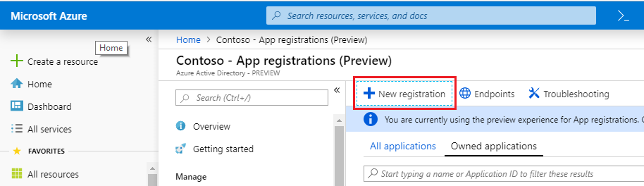
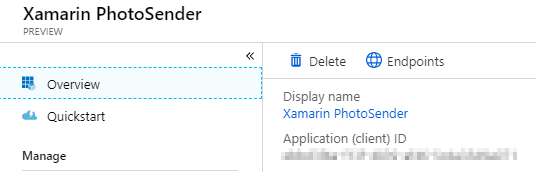

# Xamarin Forms Microsoft Graph Sample

## Configure the sample

### Register a native application in the App Registration Portal

1. Open a browser and navigate to the [Azure portal – App registrations](https://go.microsoft.com/fwlink/?linkid=2083908) and login using a **personal account** (aka: Microsoft Account) or **Work or School Account**.
1. Select **New registration**. 

    

1. When the **Register an application page** appears, enter your application's registration information: 
    - In the **Name** section, enter a meaningful application name that will be displayed to users of the app, for example `Xamarin PhotoSender`. 
    - In the **Supported account types** section, select **Accounts in any organizational directory**. 

    

1. Select **Register** to create the application. 
1. On the app **Overview** page, find the **Application (client) ID** value and record it for later. You'll need it to configure the App. Id for this project. 

    

### Add the application ID to the project

Replace the text `[APP_ID_HERE]` in the following files.

- [App.xaml.cs](./PhotoSender/PhotoSender/App.xaml.cs): Required for all platforms
- [AndroidManifest.xml](./PhotoSender/PhotoSender.Android/Properties/AndroidManifest.xml): Only required if building the Android version of the app
- [Info.plist](./PhotoSender/PhotoSender.iOS/Info.plist): Only required if building the iOS version of the app

## Contributing

This project welcomes contributions and suggestions.  Most contributions require you to agree to a
Contributor License Agreement (CLA) declaring that you have the right to, and actually do, grant us
the rights to use your contribution. For details, visit https://cla.microsoft.com.

When you submit a pull request, a CLA-bot will automatically determine whether you need to provide
a CLA and decorate the PR appropriately (e.g., label, comment). Simply follow the instructions
provided by the bot. You will only need to do this once across all repos using our CLA.

This project has adopted the [Microsoft Open Source Code of Conduct](https://opensource.microsoft.com/codeofconduct/).
For more information see the [Code of Conduct FAQ](https://opensource.microsoft.com/codeofconduct/faq/) or
contact [opencode@microsoft.com](mailto:opencode@microsoft.com) with any additional questions or comments.

## Copyright

Copyright (c) 2019 Microsoft. All rights reserved.
