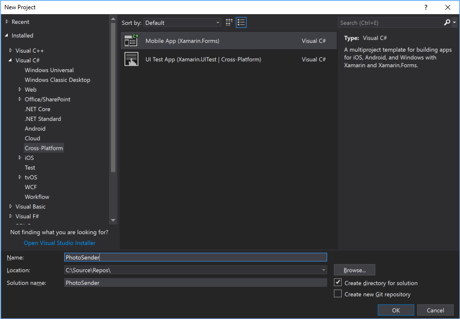
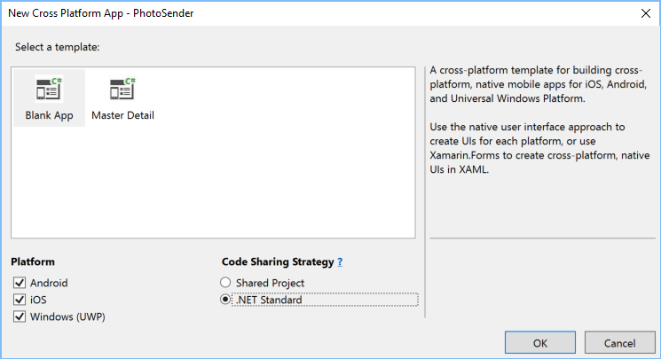
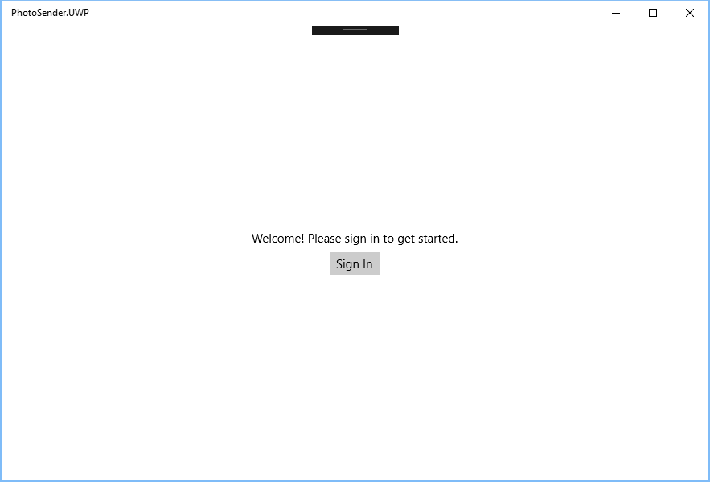
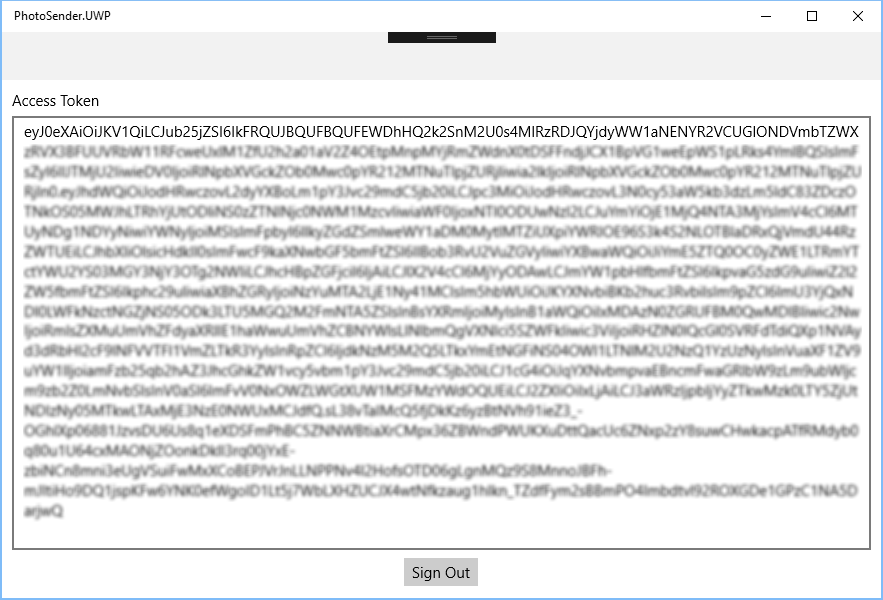

# Build mobile apps with Microsoft Graph

In this session, we'll build a cross-platform mobile application that uses the Microsoft Graph to upload a photo to OneDrive and send an email with both a OneDrive sharing link to that photo and the photo itself as an inline attachment.

## Prerequisites

- Windows 10 with [development mode enabled](https://docs.microsoft.com/en-us/windows/uwp/get-started/enable-your-device-for-development)
- Visual Studio 2017 version 15.6.6 with the Xamarin workload installed
- Android SDK for Android 7.1 and Android Emulator (installed via the [Android SDK Manager in Visual Studio](https://docs.microsoft.com/en-us/xamarin/android/get-started/installation/android-sdk?tabs=vswin))

## Create the app

1. Open Visual Studio, then choose the **File** menu, then **New**, then **Project...**.

1. Choose the **Mobile App (Xamarin.Forms)** project template (located under **Visual C#**, **Cross-Platform**). Name the app **PhotoSender** and choose **OK**.
    

1. Choose the **Blank App** template. Under **Code Sharing Strategy**, select **.NET Standard**. Choose **OK**.
    

Visual Studio will create three projects in the solution:

- **PhotoSender** - This is the .NET Standard library that will hold all of the shared code and UI.
- **PhotoSender.Android** - This project implements the Android version of the application and contains any Android-specific code.
- **PhotoSender.iOS** - This project implements the iOS version of the application and contains any iOS-specific code.
- **PhotoSender.UWP** This project implements the Universal Windows Platform version of the application and contains any UWP-specific code.

Wait for Visual Studio to finish creating the projects before moving on to the next section.

## Install NuGet packages

Next let's install the following NuGet packages.

- [Microsoft.Identity.Client](https://www.nuget.org/packages/Microsoft.Identity.Client): The Microsoft Authentication Library (MSAL) will handle the OAuth authentication needed for the Microsoft Graph.
- [Microsoft.Graph](https://www.nuget.org/packages/Microsoft.Graph/): The Microsoft Graph Client Library handles all of the Graph requests and implements types for the entities exposed by the Graph.

1. In Visual Studio, choose **Tools**, **NuGet Package Manager**, **Package Manager Console**.
1. In the **Package Manager Console**, enter the following commands.

    ```Shell
    Install-Package Microsoft.Identity.Client -Version 1.1.2-preview0008 -Project PhotoSender -Pre
    Install-Package Microsoft.Identity.Client -Version 1.1.2-preview0008 -Project PhotoSender.Android -Pre
    Install-Package Microsoft.Identity.Client -Version 1.1.2-preview0008 -Project PhotoSender.iOS -Pre
    Install-Package Microsoft.Graph -Version 1.8.1 -Project PhotoSender
    ```

## Implement sign-in

> **TIP:** To make it easier to debug in Visual Studio, change the build options on the **PhotoSender** project to generate full debug information. Right-click the **PhotoSender** project in **Solution Explorer** and choose **Properties**. Select **Build**, then **Advanced...**. Change **Debugging information** to **Full** and choose **OK**.
>
> Now is a good time to disable build of any projects that you're not actively using. If you're doing this exercise on Windows, the iOS project is disabled by default. You can also disable the Android project by selecting **Configuration Manager...** on the **Build** menu and un-checking **Build** and **Deploy**.

### Register the application

The first step is to allow the user to sign-in to the app so we can obtain an access token for calling the Microsoft Graph API. In order to do that, we need to register the application to get an application ID.

1. Open your browser and go to https://apps.dev.microsoft.com. Sign in with your Office 365 account.
1. Choose the **Add an app** button. Enter `PhotoSender` in the **Application Name** field, leave the **Let us help you get started** checkbox un-checked, and choose **Create**.
1. Choose the **Add Platform** button, then choose **Native Application**.
1. Choose **Save**.

Copy the value of **Application Id**, we'll need that value later.

### Create the sign-in UI

We'll start by creating a sign-in page for the app.

1. Right-click the **PhotoSender** project in **Solution Explorer** and choose **Add**, then **New Item...**. Choose **Content Page**, and name the file `SignInPage.xaml`. Click **Add**.
1. Replace the generated code with the following.

    ```xml
    <?xml version="1.0" encoding="utf-8" ?>
    <ContentPage xmlns="http://xamarin.com/schemas/2014/forms"
                 xmlns:x="http://schemas.microsoft.com/winfx/2009/xaml"
                 x:Class="PhotoSender.SignInPage">
        <Grid>
            <ActivityIndicator x:Name="spinner" IsVisible="false" IsRunning="false"
                               VerticalOptions="FillAndExpand" HorizontalOptions="FillAndExpand" Color="Gray"/>
            <StackLayout x:Name="slSignIn" VerticalOptions="Center" HorizontalOptions="Center">
                <Label HorizontalOptions="Center" Text="Welcome! Please sign in to get started."></Label>
                <Button x:Name="btnSignIn" HorizontalOptions="Center" Text="Sign In" Clicked="SignIn"></Button>
            </StackLayout>
        </Grid>
    </ContentPage>
    ```

This adds a simple prompt and a **Sign In** button. We'll connect an event handler to the button soon, but first, let's setup the MSAL identity client.

### Set up the identity client

In this step we'll add an instance of the `PublicClientApplication` class as a static member of the `App` class. This will make it available throughout our application.

1. In **Solution Explorer**, expand the **PhotoSender** project, then expand the **App.xaml** file, and then open **App.xaml.cs**.
1. Add the following `using` statement to the top of the file:

    ```csharp
    using Microsoft.Identity.Client;
    ```

1. Add the following members to the `App` class. Replace `[APP ID HERE]` with your app ID from the application registration portal.

    ```csharp
    public static PublicClientApplication PCA;
    public static string AppId = "[APP ID HERE]";
    public static string[] AppScopes = { "User.Read", "Mail.Read", "Mail.Send", "Files.ReadWrite" };
    public static UIParent AuthUiParent = null;
    public static bool PendingAuth = false;
    ```

1. Change the existing constructor for the `App` class to the following:

    ```csharp
    public App ()
    {
        InitializeComponent();
        PCA = new PublicClientApplication(AppId);
        MainPage = new SignInPage();
    }
    ```

Let's take a quick look at what we did here.

- We setup a static `PublicClientApplication` that is initialized with our application ID.
- We defined the scopes our app will use:
  - `User.Read`: this allows us to get information about the logged-in user, including their name, email address, and profile photo.
  - `Mail.Read`: this allows us to read the user's email messages, which we'll use to get a list of emails our app sends.
  - `Mail.Send`: this allows us to send mail as the user.
  - `Files.ReadWrite`: this allows us to upload the user's profile photo to OneDrive.

### Sign in

Now let's add code to the sign in page to do the actual sign in.

1. In **Solution Explorer**, expand the **PhotoSender** project, then expand the **SignInPage.xaml** file, and then open **SignInPage.xaml.cs**.
1. Add the following `using` statement to the top of the file:

    ```csharp
    using Microsoft.Identity.Client;
    ```

1. Add the following properties to the `SignInPage` class:

    ```csharp
    private bool isRunning = false;
    public bool IsRunning
    {
        get { return isRunning; }
        set
        {
            isRunning = value;
            slSignIn.IsVisible = !value;
            spinner.IsVisible = value;
            spinner.IsRunning = value;
        }
    }
    ```

1. Add the following method to the `SignInPage` class:

    ```csharp
    protected override async void OnAppearing()
    {
        if (!App.PendingAuth)
        {
            try
            {
                // Try to *silently* get a token
                // Silent here means without prompting the user to login.
                // This will only work if we have a previously cached token
                var result = await App.PCA.AcquireTokenSilentAsync(App.AppScopes,
                    App.PCA.Users.FirstOrDefault());

                // Since we're already logged in, proceed to main page
                await Navigation.PushModalAsync(new NavigationPage(new MainPage()), true);
            }
            catch (MsalUiRequiredException) { }
        }
    }
    ```

1. Add the following method to the `SignInPage` class:

    ```csharp
    async void SignIn(object sender, EventArgs e)
    {
        try
        {
            IsRunning = true;
            App.PendingAuth = true;
            var result = await App.PCA.AcquireTokenAsync(App.AppScopes, App.AuthUiParent);
            IsRunning = false;
            App.PendingAuth = false;
            await Navigation.PushModalAsync(new NavigationPage(new MainPage()), true);
        }
        catch (MsalException ex)
        {
            IsRunning = false;
            App.PendingAuth = false;
            await DisplayAlert("Signin Error", ex.Message, "Dismiss");
        }
    }
    ```

Let's take a quick look at what we did here.

- When the sign in page first loads, we check for a cached token. So, for example, if the user ran the app previously and did not sign out, their token is still cached in secure storage on the device. They won't have to login again. If we have a cached token, we navigate to the main page.
- We added an event handler for the **Sign In** button that does an interactive login. We set `IsRunning` to true to show the activity indicator while we wait for the user to complete the login. Once login is complete, we navigate to the main page.

Now let's update the main page to show the result of the sign in and allow the user to sign out.

1. In **Solution Explorer**, expand the **PhotoSender** project, then open **MainPage.xaml**. Replace the code there with the following code.

    ```xml
    <?xml version="1.0" encoding="utf-8" ?>
    <ContentPage xmlns="http://xamarin.com/schemas/2014/forms"
                 xmlns:x="http://schemas.microsoft.com/winfx/2009/xaml"
                 xmlns:local="clr-namespace:PhotoSender"
                 x:Class="PhotoSender.MainPage">
        <ContentPage.Padding>
            <OnPlatform x:TypeArguments="Thickness">
                <On Platform="UWP" Value="10, 10, 10, 10" />
            </OnPlatform>
        </ContentPage.Padding>
        <ContentPage.Content>
            <ScrollView>
                <StackLayout x:Name="slSignIn" VerticalOptions="FillAndExpand" HorizontalOptions="FillAndExpand">
                    <Label Text="Access Token" HorizontalOptions="Start" />
                    <Editor x:Name="tokenView" HorizontalOptions="FillAndExpand" VerticalOptions="FillAndExpand" />
                    <Button x:Name="btnSignOut" HorizontalOptions="Center" VerticalOptions="End" Text="Sign Out" Clicked="SignOut" />
                </StackLayout>
            </ScrollView>
        </ContentPage.Content>
    </ContentPage>
    ```

1. In **Solution Explorer**, expand the **PhotoSender** project, then expand the **MainPage.xaml** file, and then open **MainPage.xaml.cs**.

1. Add the following function to the `MainPage` class:

    ```csharp
    protected override async void OnAppearing()
    {
        try
        {
            // Try to *silently* get a token
            // Silent here means without prompting the user to login.
            // This will only work if we have a previously cached token
            var result = await App.PCA.AcquireTokenSilentAsync(App.AppScopes,
                App.PCA.Users.FirstOrDefault());

            tokenView.Text = result.AccessToken;
        }
        catch
        {
            // Show the signin UI
            await Navigation.PushModalAsync(new SignInPage(), true);
        }
    }
    ```

1. Add the following function to the `MainPage` class:

    ```csharp
    async void SignOut(object sender, EventArgs e)
    {
        App.PCA.Remove(App.PCA.Users.FirstOrDefault());
        // Show the sigin UI
        await Navigation.PushModalAsync(new SignInPage(), true);
    }
    ```

Let's take a quick look at what we did here.

- We added temporary UI elements to show the access token and provide a **Sign Out** button.
- We check for a cached token when the page loads and display it in an editor. If there isn't one, we send the user back to the sign in page.
- We added an event handler for the **Sign Out** button that removes the user's cached token and returns to the sign in page.

You should be able to run the app and log in, view the access token, and log out.





## Set up the Graph client

Now that we can sign in and get an access token, we can make our first Graph calls. Let's start by adding a static `GraphServiceClient` to the `App` class.

1. In **Solution Explorer**, expand the **PhotoSender** project, then expand the **App.xaml** file, and then open **App.xaml.cs**.
1. Add the following `using` statements to the top of the file:

    ```csharp
    using Microsoft.Graph;
    using System.Net.Http.Headers;
    ```

1. Add the following code to the constructor for the `App` class. Be sure to add this **after** the line that creates the new `PublicClientApplication`.

    ```csharp
    GraphClient = new GraphServiceClient(new DelegateAuthenticationProvider(
        async (request) =>
        {
            // Get token silently from MSAL
            var authResult = await PCA.AcquireTokenSilentAsync(AppScopes, PCA.Users.FirstOrDefault());

            // Add the access token to the "Authorization" header
            request.Headers.Authorization =
                new AuthenticationHeaderValue("Bearer", authResult.AccessToken);
        }
    ));
    ```

Let's take a quick look at what we did here.

- We add a static `GraphServiceClient` and initialized it with a `DelegateAuthenticationProvider`.
- In the `DelegateAuthenticationProvider`, we defined a function that the Graph client will call before making every Graph call. In that function, we get a token from the MSAL library and add it as an `Authorization` header on the outgoing HTTP request.

## Get the user's info


## Running on Android

MSAL requires additional configuration in the Android project to work properly. This is documented at https://github.com/AzureAD/microsoft-authentication-library-for-dotnet/wiki/Xamarin-android-specificities.

First, we need to require permissions to the internet. Open **./PhotoSender.Android/Properties/AndroidManifest.xml** and add the following permissions.

```xml
<uses-permission android:name="android.permission.INTERNET" />
<uses-permission android:name="android.permission.ACCESS_NETWORK_STATE" />
```

Next, we need to specify that our app handles the `msal[APP ID HERE]` URL type. When the oAuth login process finishes, it redirects to this URL, and the app needs to receive that redirect. Add the following to the manifest, replacing `[APP ID HERE]` with your app ID from the app registration portal.

```xml
<activity android:name="microsoft.identity.client.BrowserTabActivity">
    <intent-filter>
        <action android:name="android.intent.action.VIEW" />
        <category android:name="android.intent.category.DEFAULT" />
        <category android:name="android.intent.category.BROWSABLE" />
        <data android:scheme="msal[APP ID]]" android:host="auth" />
    </intent-filter>
</activity>
```

Your manifest should look like this when you're done:

```xml
<?xml version="1.0" encoding="utf-8"?>
<manifest xmlns:android="http://schemas.android.com/apk/res/android" android:versionCode="1" android:versionName="1.0" package="com.companyname.PhotoSender" android:installLocation="auto">
    <uses-sdk android:minSdkVersion="15" />
    <uses-permission android:name="android.permission.INTERNET" />
    <uses-permission android:name="android.permission.ACCESS_NETWORK_STATE" />
    <application android:label="PhotoSender.Android">
        <activity android:name="microsoft.identity.client.BrowserTabActivity">
            <intent-filter>
                <action android:name="android.intent.action.VIEW" />
                <category android:name="android.intent.category.DEFAULT" />
                <category android:name="android.intent.category.BROWSABLE" />
                <data android:scheme="msal[APP ID HERE]" android:host="auth" />
            </intent-filter>
        </activity>
    </application>
</manifest>
```

Finally, we need to add code to the Android app's main activity to set the UI parent for the login flow, and to pass the auth result along to the MSAL library. Open **./PhotoSender.Android/MainActivity.cs** and add the following `using` statement at the top of the file:

```csharp
using Microsoft.Identity.Client;
```

Then add the following function to the `MainActivity` class:

```csharp
protected override void OnActivityResult(int requestCode, Result resultCode, Intent data)
{
    base.OnActivityResult(requestCode, resultCode, data);
    AuthenticationContinuationHelper.SetAuthenticationContinuationEventArgs(requestCode,
        resultCode,
        data);
}
```

Finally, add the following line to the end of the `OnCreate` function:

```csharp
App.AuthUiParent = new UIParent(this);
```

## Running on iOS

MSAL requires additional configuration in the iOS project to work properly. This is documented at https://github.com/AzureAD/microsoft-authentication-library-for-dotnet/wiki/Xamarin-ios-specificities.

> **NOTE:** There is currently a bug with MSAL on iOS that results in the user's tokens not persisting to the cache. The bug is reported here: https://github.com/AzureAD/microsoft-authentication-library-for-dotnet/issues/546

First, we need to specify that our app handles the `msal[APP ID HERE]` URL type. When the oAuth login process finishes, it redirects to this URL, and the app needs to receive that redirect. Open the **./PhotoSender.iOS/Info.plist** file in Visual Studio, then select the **Advanced** tab. Locate the **URL Types** section and click **Add URL Type**, and fill in the fields as follows:

- **Identifier**: `com.yourcompany.PhotoSender`
- **URL Schemes**: `msal[APP ID HERE]` (Replace `[APP ID HERE]` with your app ID from the app registration portal.)
- **Role**: `Editor`
- **Icon**: Leave blank

Next, we need to add a handler for opening that URL type that forwards the information back to the MSAL library. Open the **./PhotoSender.iOS/AppDelegate.cs** file and add the following `using` statement at the top of the file:

```csharp
using Microsoft.Identity.Client;
```

Then add the following function to the `AppDelegate` class:

```csharp
public override bool OpenUrl(UIApplication app, NSUrl url, NSDictionary options)
{
    AuthenticationContinuationHelper.SetAuthenticationContinuationEventArgs(url);
    return true;
}
```